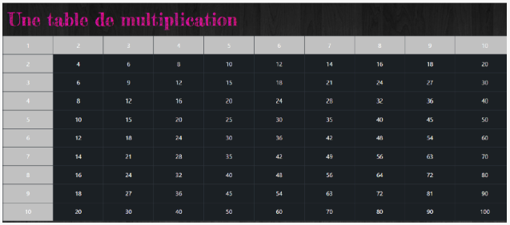
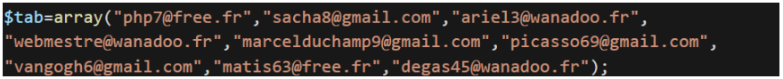
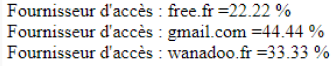

# Projet

Les rudiments du langage de script PHP - Atelier d'exercices PHP

## Description du projet

Dans ce support vous allez réaliser une série d'exercices qui vous permettront de monter en compétences sur le langage PHP.

### _Question 1_

Dans cet atelier, nous allons étudier PHP dans un contexte HTML avec différents styles de rédaction.

1 - Créer un programme PHP mult_html .php qui affiche une table de multiplication 10*10. Efforcez-vous d'utiliser au maximum les balises HTML et employez le moins possible les balises < ?php et ?>.

2 - Écrivez un nouveau programme mult_php.php de multiplication mais qui n'utilise aucune balise HTML.

3 - Comparez les deux styles.

4 - Trouvez un moyen de n'utiliser qu'une seule fois l'instruction echo (ou print) à partir du second programme (mult_sans_echos.php).

### _Question 2_

La taille des Tableaux en PHP n'est pas définie à leur création, les index peuvent être numériques ou alphanumériques, et le langage propose de nombreuses façons de les exploiter. Seule difficulté notoire, le passage d'un tableau à une fonction se fait par valeur.

1- Trouvez un moyen d'échanger les valeurs de deux variables $a et $b en une seule instruction, vous pourrez utiliser l'élément de langage PHP list (). Créez un script tableaux.php pour le tester.

2- Déclarez un tableau $pays indexé par des entiers contenant les noms de trois pays.

3- Affichez ce tableau à l'aide de l'instruction var_dump.

4- Parcourez le tableau à l'aide d'une boucle for, vous pourrez utiliser la fonction count ().

5- Parcourez de nouveau le tableau à l'aide d'une boucle foreach.

6- Pour quelle raison n'est-il pas approprié d'utiliser une boucle do ... while.

7- Ajoutez des index sous forme de chaînes de caractères pour associer les capitales aux pays du tableau $pays.

8- Combien vaut l'expression count($pays) ?

9- Comment parcourir ce tableau pour afficher chaque pays et sa capitale ?

10 - Ajouter au script en cours une fonction enumerer($t) qui prend le tableau comme paramètre et qui affiche la valeur de chaque index alphanumérique.

11 Insérez une valeur $t[« capitale »] = « pays » en créant une fonction ajouter($t) puis afficher les nouvelles valeurs du tableau résultant.

12 Affichez par var_dump le tableau après l'exécution de la fonction. Qu'en concluez-vous ?

### _Question 3_

Créez un tableau contenant une liste d'adresses e-mail.

Extrayez le nom de serveur de ces données, puis réalisez des statistiques sur les occurrences de chaque fournisseur d'accès.

Résultat de sortie :

